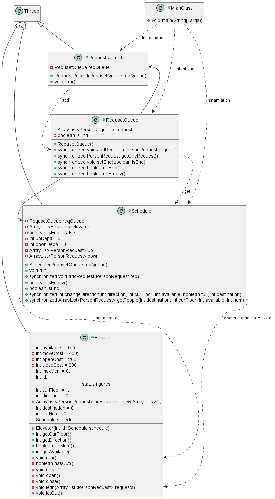
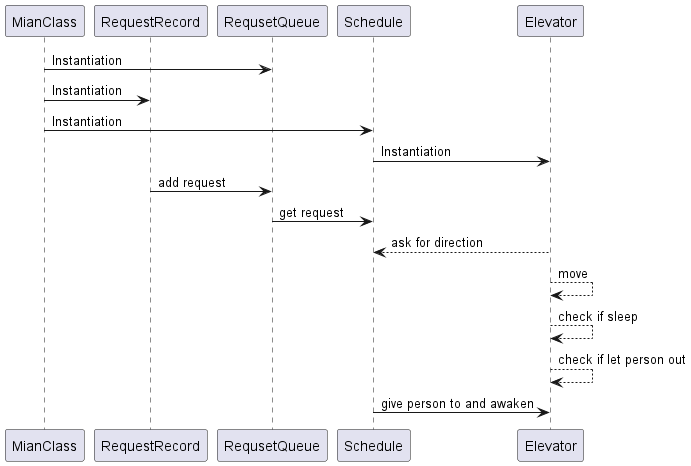
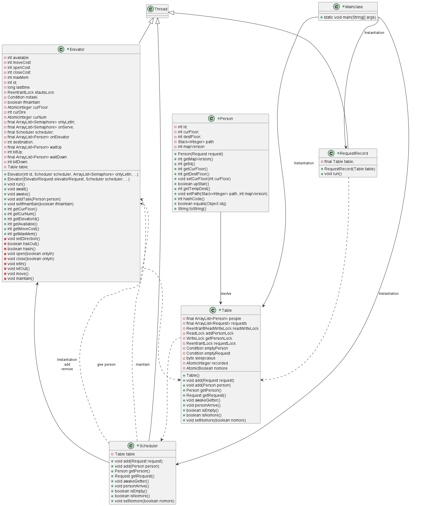
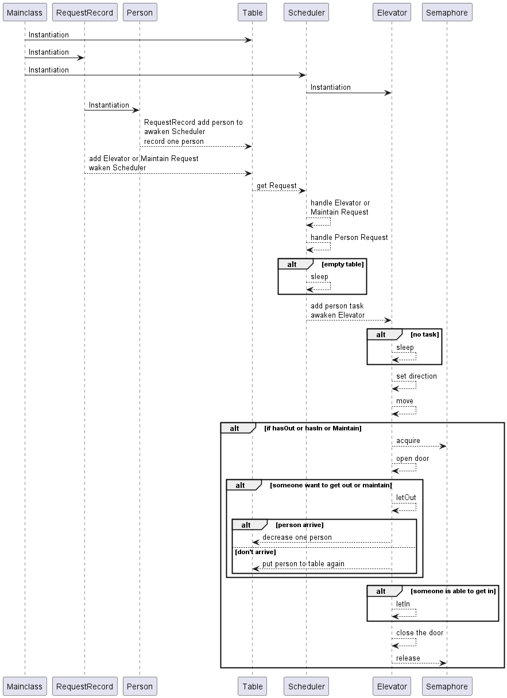

# Unit2 ELEVATOR

## 前言

本单元作业为了应对可能的问题，我采用 `输入<->调度<->电梯`的三层式架构

最后一次迭代的题目在顶层目录下, `第七次作业指导书.md`

使用datainput.exe 命令行接受一个输入txt，定时输出一条请求，然后用本程序进行接收处理

cmd下重定向输入，powershell可能得注册输出事件

## 同步块的设置与锁的选择

第四作业中我使用的是 `synchronized`关键字控制同步互斥，后面两次是使用的 `Lock`类和 `Condition`类。

选用后者的好处在于

- 效率有一定提升
- 支持更加灵活的加锁
- Condition支持定向唤醒

宏观来看，我认为整个单元最重要的数据块包含请求池，电梯状态参量两部分，前者一定是共享数据，后者共享与否视调度而定。
请求池建议封装为单独的类，在添加请求和获取请求的函数中设置对应的锁。由于题目特殊，我们可以设置添加添加不互斥，添加获取互斥，获取获取互斥的锁(Lock具有灵活的底线)，并在请求池为空时，控制调度线程休眠，在添加时尝试定向唤醒调度线程。
电梯暴露的状态变量获取接口(任务量，方向等)需要用Lock与其内部的状态变化操作互斥，状态常量(速度，最大人数，可达性等)由于没有写操作，不需要设置Lock。

**锁的设置尽量做到最小化，处理语句中包含对共享数据的操作时才加锁，没必要每个方法前加synchronized，硬生生卡成单线程**
例如：

```java
class test {
    private Object obj1,obj2;

    public void handle1() {
        synchronized(obj1) {
            obj1.execute();
        }
        for (int i; i < 114; i+=5) {
            //do something
        }
    }

    public void handle2() {
        synchronized(obj2) {
            obj2.execute();
        }
    }
}
```

## 调度策略与迭代

### hw5

第五次作业的策略是自由竞争(由于时间不够)。
调度器只根据现有请求为电梯设置方向或者给予其乘客。电梯只有乘坐池，没有等候池子，在每次move前通过调度器的方法询.问方向，要人。方向的设置是基于LOOK算法。

#### graph



线程通信图如下



#### 分析

可以看到我预先设计了电梯常量，包括可达性掩码 `available`(睿智的预测)。自由竞争的好处和坏处都是一呼百应。考虑到等待时间和运行时间，这个策略是占优势的。但是考虑到电量，这个策略在请求稀疏时会占极大劣势。这就是为什么会有85分的点

### hw6

由于预测到会出现限制进出楼层的可能，以及出于对Lock的好奇，本次作业在不改变框架的前提下进行了重写，但是由于没有设计共享请求池对象+对lock的掌握不够，输入线程与调度线程之间发生了互等的死锁 ~~这次作业没有交过~~，具体结构和hw7只差一个可达图的差距，所以这里就提下作出的改变

- 增加电梯状态共享方法，重写了调度为分发制
- 新增电梯内部运行逻辑，根据内部等待队列和在乘电梯决定操作(LOOK算法)
- 新增乘客类，用于区分不同请求并记录乘客信息
- 修改停止条件为，三层线程均无乘客
- 新增电梯对请求池的写入便于维护时退货

### hw7

相比hw6作出的改变

- 增加乘客类内部目的栈，用于记录换乘过程各段终点站，对电梯永远只暴露栈顶目的地，出电梯时更改判定是否到达并出发地
- 调度类增加内部可达邻接矩阵，以及私有的dijkstra方法获取最短换乘，为了运算效率，邻接矩阵带有一个版本标记，乘客类也有一个版本标记，当维护和新增时会改动图的版本标记，而只有在有新的乘客请求时才会检查版本是否对应以决定是否更新图并重规划路径
- 新增请求池类对乘客数目的记录，当输入线程输入时增加历史，当乘客出电梯时判定已达再减少历史，由次统一调度线程和电梯线程结束条件为无历史并且结束输入

#### graph



线程通信图如下



#### 分析

调度分发逻辑：
首先判断是否可达，在可达的情况下使用 `当前任务量/最大载客*移动耗时+楼层差`来获取预估代价进行选择分发
电梯内部逻辑：
将同属一个方向的全部请求送完再掉头送另一个方向

这个处理方法对比自由竞争会在等待时间上吃亏，但是分发机制会在电量上带来很大优势

## 稳定内容与易变内容

从电梯有自己调度的架构的角度来讲，迭代过程电梯内部只需要增加维护逻辑就好，其它不变。而变化的是调度层，包括增加管理电梯逻辑，修改分发逻辑等。管理电梯是第一次迭代的新增内容，分发逻辑是第二次迭代中部分可达电梯引入可达性造成的，两者几乎是不可避免的。

## BUG与DEBUG

初识多线程遇到bug来自两大方面：一是互斥，二是死锁
体现在代码中就是数据迷之变化和无法正常(运行)结束，第五次作业遇到了前者，我选择硬读(因为代码体量不大)，发现电梯的载人方法(供调度使用的方法)没有添加互斥，修改后顺利通过了强测互测
第六次作业摆在胡互斥上，因为没有单独将共享数据封装在共享容器里面(Table)，导致逻辑混乱，最后死锁，并不能修复
第七次作业重新确认了共享量，好好封装了共享容器，但是遇到了轮询问题，这个问题在输入线程结束后，请求池为空时会发生，最后是通过添加 `system.err.println()`发现这个问题进行了修改
第七次作业强测和互测遇到同样的问题。同一层只接人电梯过多，发生的原因是程序内语序写错了，将输出和 `release`的位置进行交换就修复了bug

## 心得体会

### 线程安全方面

重在厘清共享数据和退出逻辑
第六次作业的失败告诉我，最好将共享数据打包处理，便于后期修改和简化思路。而退出逻辑最为经典的思考就是当别的线程(比如输入线程)结束之后，余下的线程能不能保证处于可能唤醒状态并最终退出

### 层次化设计方面

涉及两大方面的数据共享，如何安排互斥逻辑，如何分配类的职责显得尤为重要，在本单元作业中(特别是第七次作业)，我的调度负责管理可达邻接矩阵，规划路径，选择电梯三大任务，对单一职责没有严格遵守，有待进一步的划分细化

## 后期优化思考

### 已经实现的

- 动态获取睡眠时间，在电梯内维护一个时间线，在开门、到新楼层、关门等节点更新改时间线，每次睡眠前通过当前时间和前一时间线的差值进行睡眠

  这个想法来自于我写C++的输出行为检查时发现判定其行为合理只需要满足与前一操作时间间隔足够大即可
- 尽量载客。考虑这么一个情况，输入许多个1到11楼，最经济的做法是，几个一起将电梯满载掉，然后直接上去。但是电梯应该是一个一个获取新指令，这就导致第一趟电梯可能只接一两个人就开跑了，为了避免它急的情况，可以在开门后进人前先小睡100ms，让它有足够时间获取更多乘客
- 位运算加速。在第五次作业便引入了这种机制(预测了可达性掩码时想到可以用位运算对上下楼的起始楼层快速判定，以及电梯内目的地快速标记)，这种思想也移用到了可达表上，将11楼信息压为一个数后图的更新可快多了

### 未实现的

- 修补自由竞争的电量弊端。通过请求池的请求数目选择关闭一部分较为弱小的电梯，达到省电的目的，但是由于第七次作业的部分可达电梯，这个关机省电的方法会变得特别复杂
- 电梯设置任务饱和。考虑一种特殊情况，维护掉很多电梯，剩一部，然后加入数百人的请求，再添入新的电梯，无限制接受的电梯会导致之前剩余的一部获得全部请求，而新加入电梯闲着没事干，所以可以考虑实现调度与电梯之间的生产者消费者模式，并给调度设置输入最大限制，这是一个十分可行的办法
- 优化路径规划。这是一个极其复杂的话题，具体表现在没有最优解，因为无法预知未来，我们能做的只是进一步的获取状态量拟合代价。传统的规划是看最小换乘，但是我们可以在边权上动手脚，比如设置换成代价为n(和两边的开关门时间有关，等待时间暂且设置为常数或者与它的运行范围挂钩，运行范围越窄，等待时间一般越小)，边权类比电阻(移动时间为电阻率，楼层差为电阻长，最大载客量为电阻横截面，电梯目前任务数为温度给电阻值一个近线性变化，各电梯是并联关系)。这个想法出自日常乘坐公交车时人们关注路况(拥挤度)和可用公交车数目
